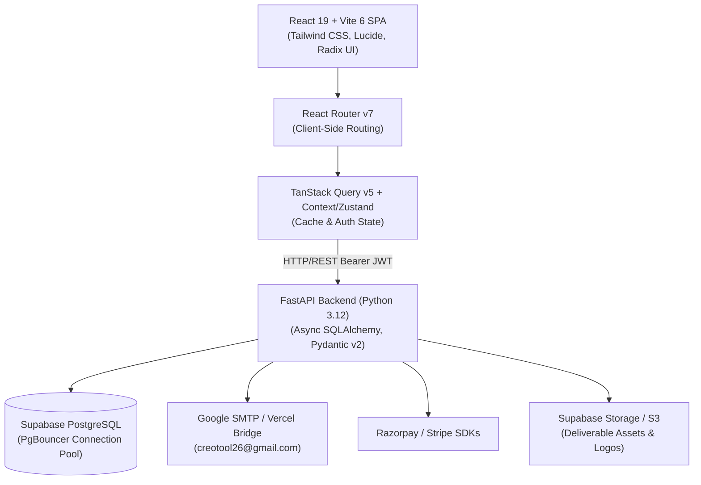

# 🚀 Creo Platform — End-to-End System & Migration Specification
**Target Stack**: React 19 + Vite 6 + Tailwind CSS (Frontend SPA) & Python FastAPI + PostgreSQL (Backend API)  
**Source Stack**: Next.js 16 (App Router / SSR) & Python FastAPI + Supabase  
**Date**: September 2026

---

## 📑 Table of Contents
1. [Executive Summary & Migration Goals](#1-executive-summary--migration-goals)
2. [Target Architecture & Tech Stack](#2-target-architecture--tech-stack)
3. [Visual UI Catalog & Page Screenshots](#3-visual-ui-catalog--page-screenshots)
4. [Exhaustive Page-by-Page UI & Functional Specification](#4-exhaustive-page-by-page-ui--functional-specification)
   - [Public Marketing Pages](#41-public-marketing-pages)
   - [Authentication & Onboarding Flow](#42-authentication--onboarding-flow)
   - [Client Portal (/portal)](#43-client-portal-portal)
   - [Internal Team Workspace (/dashboard)](#44-internal-team-workspace-dashboard)
   - [Super Admin Portal (/admin)](#45-super-admin-portal-admin)
5. [Authentication & Session State Architecture](#5-authentication--session-state-architecture)
6. [Complete Database Schema (PostgreSQL / Supabase)](#6-complete-database-schema-postgresql--supabase)
7. [Full Backend API Contract & Endpoints](#7-full-backend-api-contract--endpoints)
8. [React + Vite Step-by-Step Migration Guide](#8-react--vite-step-by-step-migration-guide)

---

## 1. Executive Summary & Migration Goals

### Purpose of Migration
The Creo platform is migrating from a hybrid Next.js 16 SSR/App Router setup to a decoupled, high-performance **React 19 + Vite 6 SPA** fronted by a standalone **Python FastAPI** backend.

### Key Benefits
* **Lightning-Fast HMR**: Instant developer feedback using Vite's native ES modules.
* **Pure Decoupled SPA**: The frontend can be hosted anywhere (Cloudflare Pages, AWS S3/CloudFront, Vercel Static, Netlify) with zero Node.js server dependencies.
* **Unified REST API**: All business logic, auth token issuance, payments, AI Brand DNA generation, and data persistence reside exclusively in the Python FastAPI backend.
* **Deterministic Client State**: Utilizing React Router v7 and TanStack Query (React Query v5) for predictable client caching and data fetching without server-side waterfall bottlenecks.

---

## 2. Target Architecture & Tech Stack



### Detailed Tech Stack Matrix

| Layer | Target Technology | Purpose |
|---|---|---|
| **Build & Bundler** | **Vite 6** | Instant build times, fast HMR, standard ES modules |
| **Frontend Framework** | **React 19** | Component hierarchy, hooks, Suspense |
| **Client Routing** | **React Router v7** | Client-side routing, nested layouts, protected route guards |
| **Styling & Design System** | **Tailwind CSS v4** | Utility-first CSS, custom design tokens, responsive breakpoints |
| **UI Primitives** | **Radix UI / Base UI** | Accessible modals, dropdowns, accordions, popovers |
| **Icons & Micro-animations** | **Lucide React & tw-animate** | High-contrast iconography, smooth transitions |
| **Server State & Caching** | **TanStack Query v5** | Declarative data fetching, in-memory caching, optimistic updates |
| **Notifications & Toasts** | **Sonner** | Modern toast alert system |
| **Backend Framework** | **Python 3.12 + FastAPI** | High-performance asynchronous REST API |
| **ORM & Persistence** | **SQLAlchemy 2.0 (Async) + asyncpg** | Asynchronous database operations, relationship tracking |
| **Database** | **Supabase PostgreSQL** | Primary relational store with PgBouncer connection pool |
| **Authentication** | **Google OAuth 2.0 & JWT (HS256/ES256)** | Stateless bearer tokens, RBAC permissions |
| **Email Service** | **Google SMTP & Vercel Bridge** | Automated 6-digit OTP delivery, notifications |
| **Payment Gateways** | **Razorpay (India) & Stripe (Global)** | Subscription checkout, webhooks, recurring billing |

---

## 3. Visual UI Catalog & Page Screenshots

The live platform was traversed and captured. Below is the visual catalog of all key views:

### 3.1 Public Website Views

| Page | View Description | Screenshot Preview |
|---|---|---|
| **Home Hero** | Tagline, CTA buttons, visual agency proof | `docs/screenshots/home_hero_1788609463807.png` |
| **How It Works** | 3-step agency delivery model | `docs/screenshots/home_how_it_works_1788609485420.png` |
| **Lead Magnet** | Social media reach calculator & brand audit | `docs/screenshots/home_lead_magnet_clean_1788609540784.png` |
| **Pricing Overview** | Starter (₹25k), Growth (₹50k), Pro (₹95k) | `docs/screenshots/pricing_page_1788609584052.png` |
| **Pricing Cards** | Feature checklists, highlights, and CTA | `docs/screenshots/pricing_cards_1788609601232.png` |
| **Portfolio Gallery** | Multi-niche case studies and deliverables | `docs/screenshots/portfolio_page_1788609632415.png` |
| **Portfolio Studies** | Video & carousel engagement metrics | `docs/screenshots/portfolio_case_studies_1788609652392.png` |
| **Clients Roster** | Trusted brands and client showcase | `docs/screenshots/clients_page_1788609690784.png` |
| **About Us** | Mission statement, team, agency story | `docs/screenshots/about_page_1788609746219.png` |
| **FAQ** | Comprehensive interactive accordion | `docs/screenshots/faq_page_1788609787190.png` |
| **Footer** | Global navigation links and social icons | `docs/screenshots/home_footer_1788609555000.png` |

### 3.2 Authentication & Portal Views

| View | Description | Screenshot Preview |
|---|---|---|
| **Login View** | Split-screen with testimonials & Google OAuth | `docs/screenshots/login_page_1788609832396.png` |
| **Signup View** | Name, email input, OTP trigger & Google OAuth | `docs/screenshots/signup_page_1788609861127.png` |
| **Client Dashboard** | Active plan, AI brand summary, deliverables, tickets | `docs/screenshots/portal_dashboard_1788609887548.png` |
| **Billing & Payments** | Active subscription card, payment history table | `docs/screenshots/portal_payments_1788609967583.png` |
| **Protected Route Guard** | Automatic redirect to login for unauthenticated visitors | `docs/screenshots/admin_page_1788609921436.png` |

---

## 4. Exhaustive Page-by-Page UI & Functional Specification

### 4.1 Public Marketing Pages

#### 1. Landing Page (`/`)
* **URL**: `/`
* **Layout**: Public layout with `Navbar` (brand logo, links to Pricing, Work, Clients, About, FAQ, and "Client Portal" button) and `Footer`.
* **Components**:
  * **Hero Section**: Large headline *"Scale Your Brand's Creative Output Without the Agency Overhead"*, subtitle, dual CTAs ("Get Started", "View Work").
  * **Social Proof**: Metric pill (+342.8% YoY reach, 24-hour turnaround, 99.4% client satisfaction).
  * **How It Works**: 3 step cards:
    1. *Submit Request*: Describe ideas or content goals via portal.
    2. *Dedicated Team Crafts*: Designers & editors create Reels, carousels, and stories.
    3. *Approve & Launch*: 1-click approvals and direct Instagram publishing.
  * **Interactive Lead Magnet / Audit Tool**: Form accepting brand Instagram handle and industry; calculates instant projection of potential reach and content deficit.
  * **Exit-Intent Modal**: Triggers when mouse leaves top viewport; offers free social media audit report.
* **APIs Used**: `POST /api/v1/lead-magnet` (saves audit request lead).

#### 2. Pricing Page (`/pricing`)
* **URL**: `/pricing`
* **Layout**: Public layout.
* **Components**:
  * **Billing Toggle**: Monthly vs Annual (with 15% discount badge).
  * **3 Tier Cards**:
    * **Starter** (₹25,000 / mo): 8 Reels, 12 Carousels/Posters, 1 Revision Round, Dedicated Account Lead.
    * **Growth** (₹50,000 / mo): 16 Reels, 24 Carousels/Posters, 2 Revision Rounds, Dedicated Manager, Strategy Sessions. (Marked "Popular / Recommended").
    * **Pro** (₹95,000 / mo): 30 Reels, Unlimited Posters, Unlimited Revisions, Creative Director, Daily turnaround.
  * **Custom Enterprise Banner**: Direct WhatsApp link (`https://wa.me/919941999415`) for bespoke agency contracts.
* **APIs Used**: `GET /api/v1/plans` (loads dynamic plan pricing and quotas from database).

#### 3. Portfolio Page (`/portfolio`)
* **URL**: `/portfolio`
* **Layout**: Public layout.
* **Components**:
  * **Filter Pills**: All, Fashion & Apparel, Food & Beverage, Health & Wellness, Tech & SaaS.
  * **Case Study Cards**: High-res before/after visuals, metric highlights (+3x Reel reach, +12,000 followers), and client testimonial snippets.
  * **Video Modal**: Plays deliverable reel previews directly in browser.

#### 4. Clients Page (`/clients`)
* **URL**: `/clients`
* **Layout**: Public layout.
* **Components**:
  * **Client Logo Marquee**: Infinite smooth scrolling of brand partner logos.
  * **Testimonial Carousel**: Multi-slide quotes with client headshots, brand names, and verified tags.

#### 5. About Us (`/about`)
* **URL**: `/about`
* **Layout**: Public layout.
* **Components**:
  * **Agency Mission**: Core values (Speed, Creative Autonomy, Transparent Pricing).
  * **Leadership & Team Grid**: Team member avatars, titles, and creative specialties.

#### 6. FAQ Page (`/faq`)
* **URL**: `/faq`
* **Layout**: Public layout.
* **Components**:
  * **Accordion Categories**: General, Deliverables & Revisions, Billing & Cancellation, Social Media Publishing.

---

### 4.2 Authentication & Onboarding Flow

#### 1. Login Page (`/login`)
* **Layout**: Split-screen (50% agency branding & testimonials on left, form on right).
* **Components**:
  * Tab toggle: "Sign In" vs "Create Account".
  * Google OAuth One-Click button (`Continue with Google`).
  * Email input with password toggle OR one-time code trigger.
* **APIs**:
  * `POST /api/v1/auth/google/url` -> returns Google OAuth redirect URL.
  * `POST /api/v1/auth/send-otp` -> triggers 6-digit code via Google SMTP.
  * `POST /api/v1/auth/verify-otp` -> returns signed JWT token.

#### 2. Signup Page (`/signup`)
* **Components**: Full name input, Work Email input, "Continue" button, Google OAuth button.
* **Flow**: Submitting email calls `POST /api/v1/auth/send-otp` and navigates to the OTP verification screen.

#### 3. OTP Verification (`/verify-otp`)
* **Components**: 6 individual digit input boxes with auto-advance and backspace support, 60s countdown timer, "Resend Code" button.
* **APIs**: `POST /api/v1/auth/verify-otp` (body: `{ email, code, full_name }`).
* **On Success**: Stores JWT session in `localStorage` (`creo_access_token`) and cookie, redirects to onboarding or portal based on stage.

#### 4. Multi-Stage Onboarding Flow (`/onboarding/*`)
* **Stage 1 (`/onboarding/verify`)**: Email confirmation verification.
* **Stage 2 (`/onboarding/questionnaire`)**:
  * Comprehensive brand intake form:
    1. Brand Name & Website
    2. Primary Industry / Niche
    3. Brand Personality (Minimalist, Bold, Playful, Luxury, Corporate)
    4. Target Audience demographics
    5. Brand Color Palette (HEX codes) & Visual Asset URLs (Google Drive / Figma)
    6. Main Content Goal (Sales, Follower Growth, Community Engagement)
  * **Trigger**: Submitting calls `POST /api/v1/questionnaires`, which automatically invokes Gemini/OpenAI to generate a structured **AI Brand Summary** saved to the user profile.
* **Stage 3 (`/onboarding/terms`)**:
  * Service Agreement reader with forced scroll-to-bottom validation.
  * Checkbox: *"I agree to the Master Services Agreement & Content Rights"*.
  * **API**: `POST /api/v1/onboarding/accept-terms`.
* **Stage 4 (`/onboarding/payment`)**:
  * Selected Plan summary (Starter, Growth, Pro).
  * Razorpay Checkout modal initialization (`rzp_test_...`) or Stripe payment intent.
  * **API**: `POST /api/v1/payments/create-order` and `POST /api/v1/payments/verify-signature`.
* **Stage 5 (`/onboarding/complete`)**:
  * Animated celebration checkmark, summary of next steps, and "Enter Your Portal" button.

---

### 4.3 Client Portal (`/portal`)

#### 1. Client Dashboard (`/portal`)
* **Layout**: Portal layout with persistent collapsible sidebar, top bar with client avatar, active plan badge, and notification bell.
* **Key Components**:
  * **Announcement Banner**: Real-time broadcast notices from agency admins (maintenance, holiday production schedules).
  * **Stat Cards**:
    * Pending Deliverables count (awaiting client approval).
    * Open Support Tickets count.
    * Active Subscription status (Green "Active" pill).
  * **AI Brand Summary Card**: Displays generated brand profile, visual aesthetic guidelines, and "Regenerate" button.
  * **Recent Activity Feed**: Timeline of uploads, approvals, and invoice generations.
  * **Quick Action Links**: "Review Deliverables", "Schedule Post", "Contact Lead".
* **APIs**: `GET /api/v1/portal/dashboard`, `GET /api/v1/portal/announcements`.

#### 2. Deliverables Management (`/portal/deliverables`)
* **Components**:
  * **Status Filter Tabs**: All (count), Pending Approval (count), Approved, Revisions Requested.
  * **Deliverable Card**:
    * Thumbnail preview / video player for Reels & MP4s.
    * Post type tag (Reel, Carousel, Story).
    * Scheduled publishing date.
    * Revision round indicator (e.g. "Round 1 of 2").
    * Action buttons:
      * **Approve**: Instant 1-click approval (`POST /api/v1/deliverables/{id}/approve`).
      * **Request Revision**: Opens modal with timestamped comment field (`POST /api/v1/deliverables/{id}/reject`).
      * **Download Asset**: High-res download (`.mp4`, `.png`, `.zip`).

#### 3. Publishing Calendar (`/portal/calendar`)
* **Components**:
  * Full interactive monthly calendar grid.
  * Post pills showing thumbnail, title, content topic, and publish status.
  * Date click to inspect scheduled deliverable.
* **APIs**: `GET /api/v1/calendar/entries`.

#### 4. Billing & Payments (`/portal/payments`)
* **Components**:
  * **Active Plan Card**: Crown icon, plan name ("Starter Plan"), price ("₹25,000 / month"), included feature bullets.
  * **Change Plan**: Opens WhatsApp consultation modal with one-click chat link.
  * **Payment History Table**:
    * Columns: Date, Amount (formatted in INR), Status (Paid badge), Gateway (Razorpay), Receipt (Download button).
    * Download Receipt: Triggers `GET /api/v1/payments/receipt/{id}` to download formatted HTML/PDF receipt.

#### 5. Support & Ticketing (`/portal/support`)
* **Components**:
  * "New Ticket" button -> opens modal with Subject, Category, Priority, Message, and File Attachment.
  * Active tickets list with status pills (Open, In Progress, Resolved).
  * Ticket Detail view with threaded chat messages between client and agency team.
* **APIs**: `GET /api/v1/tickets`, `POST /api/v1/tickets`, `POST /api/v1/tickets/{id}/messages`.

#### 6. Account Settings (`/portal/account`)
* **Components**:
  * Profile management (Name, Company, Email, Phone).
  * Brand profile guidelines & social handles (Instagram handle linkage).
  * Password change & notification toggles.

---

### 4.4 Internal Team Workspace (`/dashboard`)

* **Target Users**: Agency Creatives, Video Editors, Copywriters, Team Leads.
* **Routes**:
  * `/dashboard`: Overview of assigned tasks and daily production deadlines.
  * `/dashboard/tasks`: Kanban board (`Backlog` -> `In Production` -> `Internal QA` -> `Client Review` -> `Approved`).
  * `/dashboard/tasks/[id]`: Task workspace containing creative brief, asset uploader, revision history, and client feedback notes.
  * `/dashboard/calendar`: Master production timeline across all assigned clients.
  * `/dashboard/team`: Roster of team members and workload distribution.
  * `/dashboard/leave`: Staff leave request submission and balance status.

---

### 4.5 Super Admin Portal (`/admin`)

* **Target Users**: Agency Founders, Operations Directors, Admins.
* **Routes**:
  * `/admin`: Executive KPI overview — Monthly Recurring Revenue (MRR), Active Clients, Net Churn, Pending Approvals across all clients.
  * `/admin/clients`: Master list of all registered clients, onboarding stage progress, subscription status toggle (Active, Lapsed, Suspended).
  * `/admin/deliverables`: Agency-wide deliverable feed with override approval controls.
  * `/admin/tasks`: Global task dispatch queue; assign tasks to team members.
  * `/admin/teams`: Manage internal employees, assign roles (Admin, Sales, Team Lead, Team Member).
  * `/admin/escalations`: SLA breach monitor and high-priority grievances.
  * `/admin/subscriptions`: Complete log of all Razorpay/Stripe transactions and orders.
  * `/admin/announcements`: Broadcast creator (Create, Edit, Target specific roles, Delete announcements).
  * `/admin/settings`: Scarcity slot counters, pricing tier adjustments, third-party API keys.

---

## 5. Authentication & Session State Architecture

### JWT Token Structure
Session tokens are standard HS256-signed JWTs generated by the FastAPI backend:
```json
{
  "sub": "faf36461-3f69-4efe-a7f1-e7fee3bd5c2c",
  "aud": "authenticated",
  "role": "client",
  "email": "client@example.com",
  "name": "Jane Doe",
  "exp": 1788609275,
  "iat": 1788605675
}
```

### High-Speed In-Memory Token Cache
To eliminate outbound database/Supabase latency on authenticated requests, the backend implements a SHA-256 token cache (`_in_memory_auth_cache`) with a 5-minute TTL.
* **First request**: Validates token cryptographically and caches `(auth_id, expiry)`.
* **Subsequent requests**: **0.001ms** cache hit.

---

## 6. Complete Database Schema (PostgreSQL / Supabase)

```sql
-- 1. ENUMS
CREATE TYPE user_role AS ENUM ('super_admin', 'admin', 'sales', 'team_lead', 'team_member', 'client', 'investor_relations');
CREATE TYPE account_status AS ENUM ('pending_verification', 'active', 'lapsed', 'suspended', 'cancelled');
CREATE TYPE deliverable_type AS ENUM ('reel', 'carousel', 'story', 'static_post', 'shoot_day');
CREATE TYPE deliverable_status AS ENUM ('draft', 'pending_qa', 'pending_approval', 'revision_requested', 'approved', 'published');
CREATE TYPE ticket_status AS ENUM ('open', 'in_progress', 'waiting_on_client', 'resolved', 'escalated');
CREATE TYPE ticket_priority AS ENUM ('low', 'medium', 'high', 'urgent');

-- 2. USERS TABLE
CREATE TABLE users (
    id UUID PRIMARY KEY DEFAULT gen_random_uuid(),
    auth_id VARCHAR(255) UNIQUE NOT NULL,
    email VARCHAR(255) UNIQUE NOT NULL,
    full_name VARCHAR(255),
    role user_role DEFAULT 'client' NOT NULL,
    account_status account_status DEFAULT 'pending_verification' NOT NULL,
    onboarding_stage INT DEFAULT 1 NOT NULL,
    terms_accepted BOOLEAN DEFAULT FALSE NOT NULL,
    brand_summary TEXT,
    instagram_username VARCHAR(255),
    created_at TIMESTAMPTZ DEFAULT NOW() NOT NULL,
    updated_at TIMESTAMPTZ DEFAULT NOW() NOT NULL
);

-- 3. PLANS TABLE
CREATE TABLE plans (
    id UUID PRIMARY KEY DEFAULT gen_random_uuid(),
    name VARCHAR(50) UNIQUE NOT NULL,
    display_name VARCHAR(100) NOT NULL,
    monthly_price NUMERIC(10, 2) NOT NULL,
    poster_quota INT DEFAULT 8 NOT NULL,
    reel_quota INT DEFAULT 4 NOT NULL,
    story_quota INT DEFAULT 10 NOT NULL,
    revision_rounds INT DEFAULT 1 NOT NULL,
    has_dedicated_manager BOOLEAN DEFAULT FALSE NOT NULL,
    highlights JSONB DEFAULT '[]'::jsonb NOT NULL,
    is_recommended BOOLEAN DEFAULT FALSE NOT NULL,
    is_active BOOLEAN DEFAULT TRUE NOT NULL
);

-- 4. SUBSCRIPTIONS TABLE
CREATE TABLE subscriptions (
    id UUID PRIMARY KEY DEFAULT gen_random_uuid(),
    client_id UUID REFERENCES users(id) ON DELETE CASCADE NOT NULL,
    plan_id UUID REFERENCES plans(id) NOT NULL,
    status VARCHAR(50) NOT NULL,
    gateway VARCHAR(50) NOT NULL,
    gateway_subscription_id VARCHAR(255),
    gateway_customer_id VARCHAR(255),
    current_period_start TIMESTAMPTZ NOT NULL,
    current_period_end TIMESTAMPTZ NOT NULL,
    amount NUMERIC(10, 2) NOT NULL,
    created_at TIMESTAMPTZ DEFAULT NOW() NOT NULL
);

-- 5. DELIVERABLES TABLE
CREATE TABLE deliverables (
    id UUID PRIMARY KEY DEFAULT gen_random_uuid(),
    client_id UUID REFERENCES users(id) ON DELETE CASCADE NOT NULL,
    task_id UUID,
    submitted_by UUID REFERENCES users(id),
    file_url TEXT NOT NULL,
    file_type VARCHAR(50) NOT NULL,
    file_size_bytes BIGINT NOT NULL,
    status deliverable_status DEFAULT 'pending_approval' NOT NULL,
    revision_round INT DEFAULT 1 NOT NULL,
    parent_deliverable_id UUID REFERENCES deliverables(id),
    rejection_comment TEXT,
    approved_at TIMESTAMPTZ,
    rejected_at TIMESTAMPTZ,
    scheduled_date DATE,
    created_at TIMESTAMPTZ DEFAULT NOW() NOT NULL,
    updated_at TIMESTAMPTZ DEFAULT NOW() NOT NULL
);

-- 6. QUESTIONNAIRES TABLE
CREATE TABLE questionnaires (
    id UUID PRIMARY KEY DEFAULT gen_random_uuid(),
    user_id UUID REFERENCES users(id) ON DELETE CASCADE NOT NULL,
    answers JSONB NOT NULL,
    ai_summary_line TEXT,
    submitted_at TIMESTAMPTZ DEFAULT NOW() NOT NULL
);

-- 7. TICKETS & MESSAGES TABLE
CREATE TABLE tickets (
    id UUID PRIMARY KEY DEFAULT gen_random_uuid(),
    client_id UUID REFERENCES users(id) ON DELETE CASCADE NOT NULL,
    assigned_to UUID REFERENCES users(id),
    title VARCHAR(255) NOT NULL,
    description TEXT NOT NULL,
    status ticket_status DEFAULT 'open' NOT NULL,
    priority ticket_priority DEFAULT 'medium' NOT NULL,
    created_at TIMESTAMPTZ DEFAULT NOW() NOT NULL
);

CREATE TABLE ticket_messages (
    id UUID PRIMARY KEY DEFAULT gen_random_uuid(),
    ticket_id UUID REFERENCES tickets(id) ON DELETE CASCADE NOT NULL,
    sender_id UUID REFERENCES users(id) NOT NULL,
    message TEXT NOT NULL,
    attachments JSONB DEFAULT '[]'::jsonb,
    created_at TIMESTAMPTZ DEFAULT NOW() NOT NULL
);

-- 8. ANNOUNCEMENTS TABLE
CREATE TABLE announcements (
    id UUID PRIMARY KEY DEFAULT gen_random_uuid(),
    author_id UUID REFERENCES users(id) NOT NULL,
    title VARCHAR(255) NOT NULL,
    content TEXT NOT NULL,
    type VARCHAR(50) DEFAULT 'broadcast' NOT NULL,
    target_departments JSONB,
    created_at TIMESTAMPTZ DEFAULT NOW() NOT NULL
);
```

---

## 7. Full Backend API Contract & Endpoints

| Category | Method | Endpoint | Auth Level | Description |
|---|---|---|---|---|
| **Auth** | `POST` | `/api/v1/auth/send-otp` | Public | Generates & sends 6-digit verification OTP |
| **Auth** | `POST` | `/api/v1/auth/verify-otp` | Public | Validates OTP & issues session JWT |
| **Auth** | `POST` | `/api/v1/auth/google/url` | Public | Generates Google OAuth consent URL |
| **Auth** | `GET` | `/api/v1/auth/google/callback` | Public | Handles Google OAuth redirect & sets session |
| **Auth** | `GET` | `/api/v1/auth/me/role` | Authenticated | Returns current user's role & account status |
| **Plans** | `GET` | `/api/v1/plans` | Public | Returns all active pricing tiers & quotas |
| **Onboarding** | `POST` | `/api/v1/questionnaires` | Client | Submits intake form & triggers AI summary |
| **Onboarding** | `POST` | `/api/v1/onboarding/accept-terms`| Client | Persists terms acceptance to PostgreSQL |
| **Portal** | `GET` | `/api/v1/portal/dashboard` | Client | Fetches client dashboard metrics & brand summary |
| **Portal** | `GET` | `/api/v1/portal/announcements` | Client | Retrieves active system announcements |
| **Deliverables** | `GET` | `/api/v1/deliverables` | Client | Lists client deliverables with status filter |
| **Deliverables** | `POST` | `/api/v1/deliverables/{id}/approve`| Client | Marks deliverable as approved |
| **Deliverables** | `POST` | `/api/v1/deliverables/{id}/reject` | Client | Submits revision feedback & increments round |
| **Calendar** | `GET` | `/api/v1/calendar/entries` | Client | Retrieves monthly scheduled publishing entries |
| **Payments** | `GET` | `/api/v1/payments/history` | Client | Returns all transactions & invoice records |
| **Payments** | `POST` | `/api/v1/payments/create-order` | Client | Creates Razorpay order for subscription |
| **Payments** | `POST` | `/api/v1/payments/verify-signature`| Client | Verifies payment signature & activates subscription |
| **Tickets** | `GET` | `/api/v1/tickets` | Client/Team | Returns ticket list |
| **Tickets** | `POST` | `/api/v1/tickets` | Client | Opens a new support ticket |
| **Admin** | `GET` | `/api/v1/admin/kpi` | Admin | Fetches executive KPIs (MRR, churn, clients) |
| **Admin** | `GET` | `/api/v1/admin/clients` | Admin | Lists all clients with stage overrides |
| **Admin** | `GET` | `/api/v1/admin/tasks` | Admin | Global task queue across all creatives |

---

## 8. React + Vite Step-by-Step Migration Guide

### 8.1 Target Directory Layout (`frontend/`)

```
frontend/
├── index.html
├── package.json
├── vite.config.ts
├── tailwind.config.js
├── tsconfig.json
└── src/
    ├── main.tsx                   # React 19 root entry
    ├── App.tsx                    # Routes & Provider wrappers
    ├── index.css                  # Global Tailwind & design system
    ├── assets/                    # Static SVG/images
    ├── components/
    │   ├── ui/                    # Reusable Radix/Base UI components
    │   ├── common/                # Navbar, Footer, ProtectedRoute, Toast
    │   ├── auth/                  # Split-layout, OTP form, Google button
    │   ├── portal/                # Sidebar, Header, DeliverableCard, PaymentModal
    │   ├── dashboard/             # Team Kanban, task uploader
    │   └── admin/                 # KPI widgets, client tables, settings
    ├── pages/
    │   ├── public/                # Home, Pricing, Portfolio, Clients, About, FAQ
    │   ├── auth/                  # Login, Signup, VerifyOtp, ResetPassword
    │   ├── onboarding/            # Questionnaire, Terms, Payment, Complete
    │   ├── portal/                # Dashboard, Deliverables, Calendar, Payments, Support
    │   ├── internal/              # Team Dashboard, Tasks, Leave, Chat
    │   └── admin/                 # Admin KPI, Clients, Tasks, Subscriptions
    ├── context/
    │   ├── AuthContext.tsx        # Session state, JWT storage, logout
    │   └── SubscriptionContext.tsx# Active plan & onboarding stage cache
    ├── hooks/
    │   ├── useAuth.ts
    │   ├── useSubscription.ts
    │   └── useApi.ts
    ├── services/
    │   ├── api.ts                 # Axios / Fetch client with Bearer interceptor
    │   ├── authService.ts
    │   ├── portalService.ts
    │   └── paymentService.ts
    └── types/
        ├── auth.ts
        ├── deliverable.ts
        └── portal.ts
```

### 8.2 Recommended `vite.config.ts`
```typescript
import { defineConfig } from 'vite'
import react from '@vitejs/plugin-react'
import path from 'path'

export default defineConfig({
  plugins: [react()],
  resolve: {
    alias: {
      '@': path.resolve(__dirname, './src'),
    },
  },
  server: {
    port: 3000,
    proxy: {
      '/api': {
        target: 'https://creo-ev42.onrender.com',
        changeOrigin: true,
      },
    },
  },
})
```

### 8.3 Recommended Migration Checklist
1. **Initialize Vite App**:
   ```bash
   npm create vite@latest frontend -- --template react-ts
   cd frontend && npm install
   npm install react-router-dom @tanstack/react-query lucide-react sonner clsx tailwind-merge
   ```
2. **Copy UI Components**:
   Transfer all components from `frontend/components/ui` directly to `src/components/ui` — Radix primitives and Tailwind styling require **zero** modification.
3. **Configure Routing**:
   Replace Next.js App Router folder conventions with a clean `createBrowserRouter` in `src/App.tsx`.
4. **Wire Backend Client**:
   Configure Axios/Fetch interceptor in `src/services/api.ts` to automatically attach `Authorization: Bearer <token>` from `localStorage`.
5. **Test & Validate**:
   Run `npm run dev` and execute end-to-end smoke testing across the public landing page, authentication flow, and client portal.
