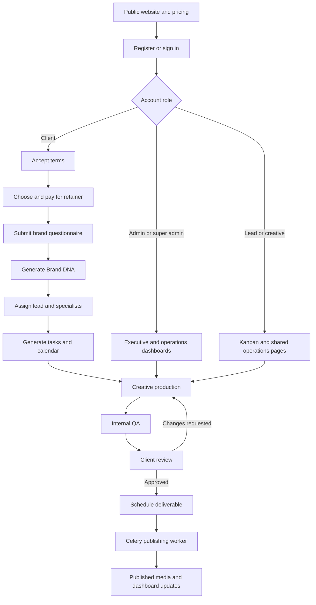

# Creo: Complete Workflow, Dashboard Behavior, and Algorithms

Updated: 10 September 2026.

This document describes the implementation in the top-level `frontend/`, `backend/`, and `database/` directories. The separate `creo/` directory is excluded. It is a documentation update, not a change to application behavior.

The descriptions below come from static code inspection. They do not certify that integrations are configured, deployed, or passing tests. Where comments, older documentation, and executable code disagree, this document follows the executable code and records the difference. Secrets and credential values are deliberately omitted.

## Contents

1. [Architecture and complete journey](#1-architecture-and-complete-journey)
2. [Roles, authentication, and navigation](#2-roles-authentication-and-navigation)
3. [Onboarding and Brand DNA](#3-onboarding-and-brand-dna)
4. [Payments, subscription expiry, and quotas](#4-payments-subscription-expiry-and-quotas)
5. [Team assignment and calendar generation](#5-team-assignment-and-calendar-generation)
6. [Task dispatch, Kanban, and SLA algorithms](#6-task-dispatch-kanban-and-sla-algorithms)
7. [Deliverables, QA, revisions, and media](#7-deliverables-qa-revisions-and-media)
8. [Publishing and background automation](#8-publishing-and-background-automation)
9. [Client dashboard and all portal pages](#9-client-dashboard-and-all-portal-pages)
10. [Admin dashboard and all operations pages](#10-admin-dashboard-and-all-operations-pages)
11. [Team lead, creative, sales, and investor workflows](#11-team-lead-creative-sales-and-investor-workflows)
12. [Dashboard refresh and cross-dashboard updates](#12-dashboard-refresh-and-cross-dashboard-updates)
13. [Data model and persistence](#13-data-model-and-persistence)
14. [Known gaps and recommended target workflow](#14-known-gaps-and-recommended-target-workflow)
15. [Validation coverage and source map](#15-validation-coverage-and-source-map)

## 1. Architecture and complete journey

### 1.1 Runtime responsibilities

| Layer | Implementation | Responsibility |
|---|---|---|
| Browser application | React 19, TypeScript, Vite, React Router | Public website, authentication, onboarding, client portal, agency operations |
| UI and interaction | Tailwind, Radix primitives, Motion, dnd-kit | Layout, dialogs, forms, transitions, drag and drop |
| Browser data access | Central `request()` wrapper, TanStack Query, component-local state | Bearer authentication, API errors, caching, polling, mutations |
| API | FastAPI | Request validation, authentication, role checks, orchestration |
| Business logic | Python services | Billing, subscription checks, quotas, assignment, state transitions, SLA, Brand DNA |
| Persistence | PostgreSQL, SQLAlchemy, Alembic | Users, subscriptions, work, schedules, audit history, notifications |
| Queue and cache | Redis and Celery | Revocation cache, publishing jobs, periodic maintenance |
| External services | Razorpay, Google OAuth, SMTP, Gemini, S3-compatible storage/Supabase, Instagram | Payments, identity, email, strategy synthesis, media, publishing |

Most API paths use `/api/v1`. Tasks and admin routers are additionally mounted without that prefix. The frontend normally uses the versioned paths.

### 1.2 Business journey



This is the intended business sequence. The current implementation has shortcuts: questionnaire submission already marks onboarding complete and dispatches work; the explicit completion endpoint dispatches again; an operations status endpoint bypasses the deliverable state machine. These differences matter when following the flow in a dashboard.

### 1.3 Public entry pages

| Route | Function | Connection to the operational flow |
|---|---|---|
| `/` | Marketing page and lead form | Lead form calls `/api/v1/lead-magnet`; no matching route was found in the inspected backend |
| `/pricing` | Pricing cards | Fetches `/api/v1/payments/plans`; includes frontend presentation/fallback data |
| `/portfolio`, `/clients` | Portfolio and client examples | Static curated data and filtering; not live operational analytics |
| `/about`, `/faq` | Company information and searchable FAQs | Informational |
| `/terms`, `/privacy` | Searchable policy content | Informational; actual acceptance is recorded through onboarding |
| `/login`, `/signup`, `/auth` | Authentication | Establishes session and chooses the role destination |
| `/health` | Health display | Polls backend health every five seconds |

## 2. Roles, authentication, and navigation

Sources: [route tree](frontend/src/app/App.tsx), [route guard](frontend/src/components/auth/ProtectedRoute.tsx), [auth provider](frontend/src/lib/auth-context.tsx), [auth router](backend/app/routers/auth.py), [RBAC](backend/app/core/rbac.py).

### 2.1 Role destinations and actual access

| Role | Declared home | Current behavior |
|---|---|---|
| `client` | `/portal` | Client portal and onboarding; backend subscription checks gate selected resources |
| `super_admin` | `/admin` | Executive and operations surfaces; backend role helper universally permits this role |
| `admin` | `/admin` | Executive and operations surfaces; frontend universally permits admin in role guards |
| `team_lead` | `/dashboard` | Shared Kanban, teams page, and operations pages allowed by their individual guards |
| `editor`, `designer` | `/dashboard` | Same Kanban component; backend forbids these roles from moving tasks directly to `ready_to_publish` |
| `sales` | `/admin/sales` | Declared destination, but outer operations guard excludes sales; backend sales endpoint requires admin-level access |
| `investor_relations` | `/admin/reports` | Inner report guard allows the role, but outer operations guard excludes it; backend reports endpoint requires admin-level access |
| `team_member` | `/dashboard` | Recognized by frontend navigation but absent from the backend `UserRole` enum |

The sales and investor destinations are therefore not complete working role journeys. Their nested guard configuration can return an access-restricted state. Login code also contains its own redirect logic, so not every login path uses the same role-home map.

### 2.2 Authentication sequence

1. Registration intent validates email uniqueness and password strength and generates an email OTP.
2. Verification checks the stored code, expiration, and attempt counter, then creates the account and session.
3. Password login verifies the stored bcrypt hash and rejects suspended users.
4. OTP login offers a separate email-code path and can create an account when one does not exist.
5. Google login exchanges an authorization code through backend OAuth handling; multiple callback routes are supported.
6. The browser stores the access token in memory and `localStorage`.
7. API requests attach `Authorization: Bearer ...` and include credentials.
8. On initial load, `AuthProvider` requests `/api/v1/auth/me` to restore the user profile.
9. Protected routes wait for that lookup, redirect unauthenticated users to login, and enforce their configured role list.

The shared HTTP wrapper clears stored tokens on most 401 responses. It does not implement automatic refresh-and-retry. A backend refresh endpoint exists, but its presence is not evidence that the frontend performs seamless session renewal.

### 2.3 OTP and rate-limit algorithm

OTP records are process-local entries containing code, expiry, and attempts. Codes expire after 600 seconds. Registration, login OTP, and reset OTP use separate key conventions. Verification checks expiration and an attempt threshold before accepting a match.

The auth rate limiter uses a sliding window:

```text
timestamps = previously recorded attempts newer than now - window
if count(timestamps) >= limit:
    reject request
otherwise:
    append now and continue
```

Examples in code: registration/OTP/reset request limits use five requests per ten minutes; password login uses ten attempts per fifteen minutes. These are per-process limits, not shared distributed limits. With multiple API workers, OTP availability and rate-limit state can differ between workers.

### 2.4 Password reset and backend access

Forgot-password creates a reset OTP. Reset verification issues a session marked `must_reset_password`. The backend token guard permits only `/auth/me`, `/auth/logout`, and `/auth/set-mandatory-password` for such a token. The frontend displays a mandatory reset modal.

The backend derives the actor from JWT claims and checks a revocation/suspension cache. Frontend role checks control navigation; they do not replace API authorization.

Observed gaps: registration paths infer privileged roles from email text; startup resets a fixed super-admin account password; an admin-seed reset route exists; account-page password change does not verify the supplied current password. These are implementation defects, not intended authentication algorithms.

## 3. Onboarding and Brand DNA

Sources: [onboarding UI](frontend/src/features/onboarding/OnboardingView.tsx), [questionnaire UI](frontend/src/features/onboarding/StageQuestionnaire.tsx), [onboarding router](backend/app/routers/onboarding.py), [service](backend/app/services/onboarding_service.py), [stage view](backend/alembic/versions/0002_views.py).

### 3.1 Derived stage algorithm

The stage is read from `v_client_onboarding`, rather than accepted from the browser. The migration defines a descending-priority CASE expression:

| Priority | Database fact | Stage |
|---|---|---:|
| 1 | `onboarding_completed_at` exists | 5 |
| 2 | Questionnaire row exists | 4 |
| 3 | Active/trialing subscription row exists | 3 |
| 4 | Terms acceptance timestamp exists | 2 |
| 5 | Email verified or account status is not pending verification | 1 |
| 6 | None of the above | 0 |

This is precedence-based classification, not a proof that every earlier step is valid. In particular, stage 5 can remain after subscription expiry. The view checks subscription status but not period end. Subscription authorization must therefore remain separate from onboarding progress.

### 3.2 Screen-by-screen flow

| Screen | Input and action | Backend consequence |
|---|---|---|
| Verify email | Email and OTP | Establishes authenticated account |
| Terms | Read terms and accept | Requires stage >= 1; saves acceptance time and version |
| Payment | Select plan and open Razorpay | Creates incomplete subscription and attempts payment confirmation |
| Questionnaire | Brand, audience, tone, goals, content preferences, colors | Requires stage >= 3; upserts answers and profile fields |
| Strategy preview | View generated Brand DNA | Reads stored strategy; supports returning to edit |
| Confirm/complete | Confirm strategy and proceed | Calls completion endpoint, assigns team and generates calendar again |
| Completion | Team cards and launch portal | Reads assigned members and Brand DNA |

The UI polls onboarding status every five seconds and remembers the selected step in a user-specific localStorage key. Questionnaire drafts are also stored locally per user. Requested/saved steps are limited by the currently unlocked step.

### 3.3 Actual questionnaire transaction sequence

```text
POST /onboarding/questionnaire
    derive stage and require stage >= 3
    insert/update questionnaire
    update company and Instagram fields
    set onboarding completion timestamp if missing
    set onboarding deadline to now + 7 days
    commit
    await Brand DNA generation
    await team assignment and calendar generation
    return success

POST /onboarding/complete
    require stage >= 4
    reset completion/deadline timestamps
    run team assignment and calendar generation again
    return assigned team
```

Despite comments describing queued generation, Brand DNA is awaited inside the questionnaire HTTP request. The process commits at multiple stages; later failure can leave earlier steps persisted.

### 3.4 Brand DNA algorithm

Source: [brand_dna.py](backend/app/services/brand_dna.py).

1. Load the questionnaire and its brand inputs.
2. If a Gemini API key is present, request structured strategy JSON with an HTTP timeout.
3. Strip Markdown code-fence wrappers from the returned JSON when present.
4. Parse and validate the strategy against the Brand DNA schema.
5. If the external call or parsing fails, build a deterministic strategy from the supplied brand information.
6. Persist the strategy JSON and summary on the client profile and summary information on the questionnaire.
7. Return stored status/results through `/onboarding/brand-dna/status`.

Outputs include tone, palette, target audience, summary, audience persona, and goal alignment. The deterministic fallback uses the supplied audience, tone, colors, and content focus plus defaults. It is rule-based text construction, not a trained recommendation or scoring model. The progress animation in the UI is simulated presentation progress, not measured model completion percentage.

## 4. Payments, subscription expiry, and quotas

Sources: [payments router](backend/app/routers/payments.py), [payment service](backend/app/services/payment_service.py), [subscription guard](backend/app/services/subscription_guard.py), [quota service](backend/app/services/quota_service.py).

### 4.1 Order creation

1. Look up an active plan.
2. Resolve the client. A legacy fallback can select another existing client or create a placeholder if the supplied user is absent; this should not be treated as valid tenant resolution.
3. Expire stale active/trialing subscriptions.
4. Reject a new order when an unexpired active/trialing subscription already exists.
5. Generate a local placeholder order ID.
6. If Razorpay credentials are present, attempt creation of a real Razorpay order using the plan price in minor units.
7. Save an `incomplete` subscription and return checkout details.

If live order creation fails, code can retain the placeholder order ID. That does not establish a real payable order at the gateway.

### 4.2 Confirmation and webhook behavior

```text
find subscription by gateway and order ID
if already active/trialing: return active

valid_signature = constant-time comparison of
    HMAC-SHA256(secret, order_id + "|" + payment_id)

sandbox_bypass = environment != production OR gateway secret is missing

if valid_signature OR sandbox_bypass:
    activate subscription immediately
else:
    poll subscription for up to 6 seconds, every 0.5 seconds
    return active or pending
```

This differs from the old documented rule that only webhooks activate subscriptions. Missing credentials can enable the bypass even when the environment is production. Confirmation lookup is by order/gateway rather than explicitly by actor ownership in the service.

Webhook handling verifies the raw-body HMAC, inserts a payment event with a unique `(provider, provider_event_id)` pair, and skips duplicate inserts. A newly inserted event is committed and then processed. Processing finds a subscription, activates it, seeds quotas, and marks the event processed.

Limitations: a failure after event insertion can leave an unprocessed event that a duplicate delivery simply skips; processing logic should not be assumed to comprehensively validate capture state, amount, or every event type. The older runbook's separate payment replay task is not present among the inspected worker files.

### 4.3 Activation and period arithmetic

Activation sets subscription status to active, marks the account active, and sets:

```text
current_period_start = current UTC time
current_period_end   = current UTC time + 30 days
```

Quota counters use calendar-month boundaries rather than this rolling 30-day subscription window:

| Plan field | Counter kind |
|---|---|
| `reel_quota` | `reel` |
| `poster_quota` | `static_post` |
| `story_quota` | `carousel` |

Counter insertion uses conflict-ignore for `(client_id, period_start, kind)`. Repeating activation in the same calendar month does not automatically replace an existing counter's quota. A separate `story` counter is not seeded by this activation mapping.

### 4.4 Subscription expiry algorithm

1. A database update changes active/trialing subscriptions whose end has passed to canceled.
2. The check loads the client's newest subscription by creation time and its plan.
3. Compare its period end with application UTC time.
4. Return `is_active`, `is_expired`, status, server time, remaining seconds, and remaining days.

```text
seconds_remaining = max(0, floor(period_end - now_utc in seconds))
days_remaining    = max(0, ceil((period_end - now_utc) / 86400))
is_active         = status in {active, trialing} AND period_end > now_utc
```

The expiry update uses database time; the returned countdown uses application time. They are not exclusively one database-clock calculation. Selecting the newest subscription can also hide an older active one when a newer incomplete record exists.

Client-only gates return HTTP 402 when the retainer is inactive. Staff/admin bypass is explicitly defined in the guard. Calendar, deliverable access, and several portal screens use subscription checks, but gating is not uniformly applied across every API route.

### 4.5 Browser countdown

The payments page anchors a countdown to the server's remaining seconds and subtracts elapsed `performance.now()` time every second. This avoids using the user's wall clock for each tick. At zero it marks the local view expired and invalidates subscription data. The backend remains authoritative; this timer is only a display mechanism.

### 4.6 Atomic quota consumption

```sql
UPDATE usage_counters
SET used = used + 1
WHERE client_id = :client
  AND period_start = :period
  AND kind = :kind
  AND used < quota
RETURNING used, quota;
```

The actual service uses this conditional-update pattern. One atomic update avoids a read-then-increment race. No updated row means either quota exhausted or counter missing, which the service distinguishes. Release decrements only when `used > 0`; the database also enforces `0 <= used <= quota`.

Client upload intent consumes quota before media confirmation. An abandoned-upload compensation job is described in comments but was not found in the configured periodic jobs. Staff upload paths do not uniformly apply this quota flow.

## 5. Team assignment, calendar generation, and dispatch engine

Sources: [dispatch_engine.py](backend/app/services/dispatch_engine.py), [fair_dispatch_service.py](backend/app/services/fair_dispatch_service.py), [dispatch_service.py](backend/app/services/dispatch_service.py).

The dispatch and planning architecture uses **one unified eligibility engine with two calling policies**:
- **Policy A (Continuity-First)**: Routes revisions and client tasks to the Original Creator -> Dedicated Pod Specialist -> Open Pool fallback.
- **Policy B (Load-First)**: Windowed capacity ranking under pessimistic row locking (`FOR UPDATE`).

### 5.1 Effort model and capacity denomination

Workload capacity is denominated in **Effort Points**, not raw task counts:

| Format kind | Deliverable type | Base effort points | Revision effort points (0.4×) | Lead days |
|---|---|---:|---:|---:|
| `reel` | `REEL` | 5 pts | 2 pts | 4 business days |
| `shoot_day` | `SHOOT_DAY` | 8 pts | 4 pts | 6 business days |
| `carousel` | `CAROUSEL` | 3 pts | 2 pts | 3 business days |
| `poster` / `static_post` | `STATIC_POST` | 2 pts | 1 pt | 2 business days |
| `story` | `CAROUSEL` / `STORY` | 1 pt | 1 pt | 1 business day |

Staff profiles define `daily_points` (default: 8 pts/day, calibrated against `daily_capacity`). An editor with 8 points/day carries approximately 1 Reel + 1 Carousel, or 4 Posters.

### 5.2 Windowed eligibility engine

Load is evaluated over the task's **Delivery Window** `[due_date - 2 days, due_date]`, not just today:

```sql
WITH deliv_window AS (
  SELECT CAST(:w_start AS DATE) AS w_start,
         CAST(:w_end AS DATE)   AS w_end
),
committed AS (
  SELECT t.assigned_to AS staff_id,
         COALESCE(SUM(t.effort_points), 0) AS points_in_window,
         COUNT(t.id) AS active_wip
    FROM tasks t, deliv_window w
   WHERE t.status IN ('in_production', 'internal_qa')
     AND (t.due_date BETWEEN w.w_start AND w.w_end OR t.due_date IS NULL)
   GROUP BY t.assigned_to
),
available AS (
  SELECT sp.user_id,
         sp.daily_capacity,
         GREATEST(sp.daily_points, sp.daily_capacity * :task_points) AS daily_points,
         sp.skills,
         sp.last_assigned_at,
         (SELECT COUNT(*) FROM generate_series(w.w_start::timestamp, w.w_end::timestamp, '1 day'::interval) d
           WHERE EXTRACT(isodow FROM d) < 6
             AND NOT EXISTS (
               SELECT 1 FROM leave_requests l
                WHERE l.user_id = sp.user_id
                  AND l.status = 'approved'
                  AND d::date BETWEEN l.start_date AND l.end_date)) AS working_days
    FROM staff_profiles sp
    JOIN users u ON u.id = sp.user_id AND u.account_status = 'active'
   CROSS JOIN deliv_window w
   WHERE sp.is_accepting_work = TRUE
     AND NOT EXISTS (
       SELECT 1 FROM leave_requests l
        WHERE l.user_id = sp.user_id
          AND l.status = 'approved'
          AND w.w_end BETWEEN l.start_date AND l.end_date
     )
)
SELECT a.user_id,
       (a.daily_points * a.working_days) AS capacity_points,
       COALESCE(c.points_in_window, 0) AS used_points,
       (COALESCE(c.points_in_window, 0)::float / NULLIF(a.daily_points * a.working_days, 0)) AS utilization,
       a.last_assigned_at,
       a.daily_capacity,
       COALESCE(c.active_wip, 0) AS active_wip
  FROM available a
  LEFT JOIN committed c ON c.staff_id = a.user_id
 WHERE (:has_override = TRUE AND :required_skill = ANY(a.skills)
      OR :has_override = FALSE AND (:required_skill = ANY(a.skills) OR :deliv_type = ANY(a.skills)))
   AND a.working_days > 0
   AND COALESCE(c.active_wip, 0) < a.daily_capacity
   AND COALESCE(c.points_in_window, 0) + :task_points <= (a.daily_points * a.working_days)
 ORDER BY utilization ASC,
          a.last_assigned_at ASC NULLS FIRST
 LIMIT 10;
```

**Key Improvements:**
1. Leave is evaluated across the delivery window; any staff on approved leave on the due date is strictly excluded.
2. Capacity scales down proportionally if someone is partially on leave inside the delivery window.
3. Tie-breaking rewards `last_assigned_at ASC NULLS FIRST` (longest waiting) rather than punishing fast workers.

### 5.3 Durable pod assignment

Onboarding completion establishes durable team **ownership**, not individual task assignments:
- **Team Lead**: Lowest active client count (`COUNT(client_assignments.id) ASC`), tie-broken by oldest assignment timestamp, prioritizing `@creo.agency` internal team accounts.
- **Video Editor & Graphic Designer**: Lowest client assignment count, with affinity to the selected Team Lead's pod.

### 5.4 Quota-driven calendar drafting & client approval gate

1. **Draft Generation**: Quotas from subscription plan (`reel_quota`, `poster_quota`, `story_quota`) are evenly distributed (`evenly_spaced`) across preferred template days in the client's local timezone (`client_profiles.timezone`, default: `Asia/Kolkata` at 19:30 for Reels, 12:30 for Posters, 18:00 for Carousels, 20:00 for Stories).
2. **Draft State**: Created with `status = 'draft'` and `is_locked = False`. No production tasks are spawned yet.
3. **Approval Gate**: Client (or account manager) reviews the draft plan and executes `POST /api/v1/calendar/approve`.
4. **Materialization**:
   - Calendar slots lock (`status = 'approved'`, `is_locked = True`).
   - Production tasks are created with format-specific lead times (`due_date = publish_date - LEAD_DAYS[kind]`).
   - Tasks entering the **10-day rolling horizon** are immediately dispatched via `assign_continuity_first`.

### 5.5 Nightly rolling horizon & rebalance sweeps

Implemented via Celery Beat tasks in [scheduler.py](backend/app/workers/tasks/scheduler.py):
1. **Rolling 10-Day Window Dispatcher (`assign_upcoming_window_task`)**: Runs nightly at 01:00 IST to dispatch backlog tasks due within 10 days to dedicated pod specialists.
2. **Operational Rebalance Sweep (`rebalance_nightly_sweep_task`)**: Runs nightly at 02:00 IST:
   - Detects newly approved leave covering unstarted backlog tasks and reassigns them.
   - Escalates backlog tasks aging > 24 hours to team leads.
   - Dispatches priority alerts for tasks within 24 hours of their SLA deadline.
   - **Strict Invariant**: Never reassigns a task already marked `in_production` (protects in-flight work and specialist trust).

## 6. Task Kanban and SLA algorithms

Sources: [dispatcher](backend/app/services/dispatch_service.py), [tasks router](backend/app/routers/tasks.py), [Kanban UI](frontend/src/features/kanban/KanbanBoard.tsx), [SLA service](backend/app/services/sla_service.py).

### 6.1 Kanban board state machine

The board aggregates columns (`backlog`, `in_production`, `internal_qa`, `client_review`, `ready_to_publish`) using optimized SQL aggregation.

### 6.2 SLA turnaround tiers

| Plan | Reel | Carousel | Story | Static post | Shoot day |
|---|---:|---:|---:|---:|---:|
| Starter | 48 h | 48 h | 24 h | 24 h | 72 h |
| Growth | 36 h | 36 h | 18 h | 18 h | 48 h |
| Scale | 24 h | 24 h | 12 h | 12 h | 24 h |

Formula: `sla_due_at = base_time_or_now + configured_hours`. Production calendar assets use format-specific lead dates (`LEAD_DAYS`) set to 18:00 UTC on the due date.

## 7. Deliverables, QA, revisions, and media

Sources: [deliverables router](backend/app/routers/deliverables.py), [state service](backend/app/services/deliverable_state.py), [storage](backend/app/services/storage_service.py), [review UI](frontend/src/features/deliverables/ContactSheet.tsx).

### 7.1 Two media entry paths

| Path | Behavior |
|---|---|
| Upload intent and confirmation | Validates MIME/declared size, optionally consumes client quota, returns signed upload URL, verifies storage object, creates deliverable |
| Operations upload/create | Uploads to backend-local deliverables storage or accepts a supplied media URL and creates a record through admin routes |

Storage service prefers configured S3-compatible storage, then Supabase storage, with development/test mock fallbacks. Its declared size ceiling is 512 MiB. S3 confirmation checks actual object size; the Supabase branch does not provide the same strict size comparison. Default signed GET lifetime is 900 seconds. Existing HTTP URLs and selected local static URLs can pass through URL resolution, so not every displayed asset is a private signed object.

### 7.2 Deliverable state graph

| Current state | Allowed next states in `TRANSITIONS` |
|---|---|
| `draft` | `in_production`, `archived` |
| `in_production` | `pending_qa`, `archived` |
| `pending_qa` | `qa_rejected`, `pending_approval` |
| `qa_rejected` | `in_production` |
| `pending_approval` | `revision_requested`, `approved` |
| `revision_requested` | `in_production`, `pending_qa`, `archived` |
| `approved` | `scheduled`, `published`, `archived` |
| `scheduled` | `publishing`, `approved`, `archived` |
| `publishing` | `published`, `publish_failed` |
| `publish_failed` | `scheduled`, `archived` |
| `published` | `archived` |
| `archived` | None |

`transition()` validates the edge and permitted role, checks revision limits where needed, changes the status, stamps relevant timestamps, writes an audit record, and commits. Scheduling requires a timestamp. QA approval/rejection is lead/admin work; client approval/revision is client/admin work; automated publication uses a system/admin role.

The operations status endpoint directly assigns the enum and commits, bypassing this graph and its audit/revision checks. The scheduler also changes status through SQL. Therefore the state service is the intended controlled path, but not the only actual writer.

### 7.3 Review loop and revision ceiling

1. Staff submits work to QA.
2. Lead rejects with notes or approves for client review.
3. Client opens the contact sheet and previews an image/video.
4. Approval moves the deliverable forward and updates linked task information where implemented.
5. Change request requires a comment and checks the plan's revision allowance.
6. If `current_round >= allowed_rounds`, return `REVISION_LIMIT_REACHED`; the frontend shows the corresponding revision/upgrade message.
7. Otherwise increment the round and record feedback.

The version helper creates a new record sharing `root_id` with incremented version and archives the previous version. It is a helper, not a separately decorated public endpoint in the inspected router. The database prohibits duplicate `(root_id, version)` pairs.

Approval accepts an `Idempotency-Key` header, but the route's visible repeat handling is primarily an already-approved status check. A header alone is not durable request-hash/result replay protection.

### 7.4 Client list algorithm

The client list filters tenant and optional status, orders deliverables, uses a cursor based on the last record and its creation time, and fetches an extra row to determine whether another page exists. It returns resolved media URLs and pagination metadata. The contact sheet polls every ten seconds and uses optimistic approval state followed by query invalidation.

## 8. Publishing and background automation

Sources: [Celery configuration](backend/app/workers/celery_app.py), [scheduler](backend/app/workers/tasks/scheduler.py), [publish worker](backend/app/workers/tasks/publish.py), [Instagram adapter](backend/app/services/instagram_client.py).

### 8.1 Claiming due work

Every minute the scheduler claims up to 50 due `scheduled` deliverables ordered by schedule time. A `FOR UPDATE SKIP LOCKED` subquery lets concurrent claimers skip locked rows. The update changes claimed rows to `publishing`, commits, and then enqueues a job for each ID.

If enqueueing fails after the commit, the code logs a warning. The rows remain publishing and the next scheduled-only query will not reclaim them. A transactional outbox or stale-claim recovery is not implemented in this path.

### 8.2 Three-phase publish algorithm

1. Load/lock deliverable and reject unsuitable states; an already-published row is skipped.
2. Resolve client integration information and refresh an expiring token when applicable.
3. Read publishing quota. The implementation treats usage >= 25 as rate limited and schedules retry behavior; this is a code constant, not a verified current platform policy.
4. **Create:** when `ig_creation_id` is absent, create a media container and persist the ID.
5. **Poll:** inspect container state until finished, error, or timeout. The loop is bounded around a 300-second transcoding wait.
6. **Publish:** publish the finished container, save media ID/permalink, and transition the record to published.
7. On container error, clear the creation ID and mark publish failed; transient failures use retries.

Persisting the container ID lets a retry resume after container creation. It does not prove exactly-once behavior for every crash window, especially an external publish that succeeds before its database result is committed.

Fake and real Instagram adapters exist; configuration defaults to fake mode. The fake adapter simulates polling and failures for tests. The account page's generated connection ID is not a verified production OAuth connection.

### 8.3 Periodic jobs

| Job | Schedule | Purpose |
|---|---|---|
| Due publish dispatch | Every minute | Claim and enqueue scheduled deliverables |
| SLA breach sweep | Hourly, minute 0 | Mark and notify previously unnotified overdue tasks |
| Executive KPI refresh | Every 15 minutes | Refresh materialized aggregate |
| Instagram token refresh | Daily, 03:00 Asia/Kolkata | Refresh tokens expiring within three days |
| Stale onboarding sweep | Hourly, minute 30 | Mark overdue incomplete onboarding accounts lapsed |
| Weekly client digest | Monday, 08:00 Asia/Kolkata | Dispatch client summary notifications |

Celery defines `default` and `publish` queues, late acknowledgment, worker-loss rejection, prefetch 1, and 900/840-second hard/soft limits. These configuration values do not establish that workers are currently running. The Windows launcher starts the API and frontend, not the full worker/beat/database stack.

Notification delivery supports stored in-app records and external channel handling. Auth OTP mail uses SMTP; worker email delivery uses Resend configuration. These are distinct delivery paths.

## 9. Client dashboard and all portal pages

### 9.1 Dashboard: `/portal`

Source: [PortalDashboardPage](frontend/src/pages/portal/PortalDashboardPage.tsx), [portal API](backend/app/routers/portal_dashboard.py).

The page calls `/portal/dashboard` every fifteen seconds. The API reads user/profile, onboarding stage, subscription snapshot, assigned team, pending approvals, open tickets, and the latest five deliverables.

| Display | Calculation/source |
|---|---|
| Pending reviews | Deliverables whose status is exactly `pending_approval` |
| Open support count | Tickets in `open` or `in_progress` |
| Retainer and countdown | Latest-subscription check and associated plan |
| Brand summary | Stored profile Brand DNA/summary |
| Creative pod | Assignment rows joined to users |
| Recent activity | Five newest deliverables, not a complete audit-event stream |
| Onboarding progress | Derived view stage |

The API accepts a `client_id` query parameter without an explicit client-ownership comparison in this handler. Also, its effective account-status calculation checks whether an `active_plan` object exists, even though that object can represent an expired plan. Consumers should use `has_active_subscription` and expiry fields instead of trusting that label alone.

### 9.2 Deliverables: `/portal/deliverables`

Checks subscription state, shows a locked/renewal state when required, then renders the contact sheet. The user previews assets, approves, or requests revision. Main APIs are `/portal/deliverables`, `/deliverables/{id}/approve`, `/request-changes`, and `/versions` beneath the versioned prefix. Mutation success refreshes the deliverable query; other dashboard counters update on their own next read.

### 9.3 Calendar: `/portal/calendar`

Source: [PortalCalendarPage](frontend/src/pages/portal/PortalCalendarPage.tsx), [calendar router](backend/app/routers/calendar.py).

Checks subscription and fetches `/calendar/entries`. The UI groups entries by date, builds the selected month grid or list, applies a format filter, and shows selected-day/asset details. Planned calendar entries can exist without a deliverable. Format metadata can be inferred from linked work and caption/media information; a calendar row alone does not mean an asset is uploaded, approved, or queued for publication.

### 9.4 Payments: `/portal/payments`

Shows the current retainer, quotas, period, and countdown; provides plan-selection and add-on modals. Calls `/payments/subscription`, `/payments/plans`, `/payments/orders`, `/payments/confirm`, and `/payments/addon-order`.

An active retainer prevents overlapping plan purchase; expiry enables renewal. Successful payment handling invalidates subscription data. The UI's success message must not be treated as independent gateway verification. The add-on endpoint creates an order, but a complete durable fulfillment/entitlement workflow is not established by the corresponding admin completion handler.

### 9.5 Support: `/portal/support`

Checks subscription for its screen state, lists tickets with ten-second polling, and lets the client create a ticket with title, description, and priority. The backend also exposes ticket detail and threaded message APIs. Ticket creation persists an open ticket; operations staff can reply or change status through the admin support surface.

The ticket backend does not consistently enforce client ownership on detail/message lookups, and list accepts an explicit client ID. Screen-level locking is not an API security boundary. No automatic four-hour support-response SLA engine was found in this ticket workflow.

### 9.6 Account: `/portal/account`

Source: [PortalAccountPage](frontend/src/pages/portal/PortalAccountPage.tsx).

| Action | Backend behavior |
|---|---|
| Read profile | Returns user, company, questionnaire, Brand DNA, and assigned team |
| Save profile | Updates selected user/profile fields and questionnaire answers |
| Change password | Hashes new password; current password is required as input but not compared to existing hash |
| Toggle 2FA | Saves `two_fa_enabled` inside Brand DNA JSON; does not implement a second-factor challenge |
| Connect Instagram | Saves username and generated ID; does not complete real OAuth/token acquisition |
| Disconnect Instagram | Clears connection fields/token |
| Regenerate Brand DNA | Invokes strategy regeneration for saved questionnaire data |

Phone and security-preference metadata share the Brand DNA JSON container. This mixes account settings with strategy data and should be considered when regenerating or replacing the JSON.

### 9.7 Shared portal navigation

Header notifications poll every fifteen seconds; single/all-read actions persist read state. Announcements poll every thirty seconds and dismissed IDs are stored in localStorage. Dismissal is browser-local. Sidebar and mobile tabs use subscription data to present locked access and navigation state.

## 10. Admin dashboard and all operations pages

Sources: [AdminDashboard](frontend/src/features/admin/AdminDashboard.tsx), [AdminSubPages](frontend/src/features/admin/AdminSubPages.tsx), [admin API](backend/app/routers/admin.py).

### 10.1 Executive dashboard: `/admin`, `/admin/dashboard`

On mount the UI fetches KPIs, client roster, queue, and SLA breaches in parallel. It maintains local component state. The aggregate `/admin/dashboard` endpoint exists, but this component uses the four separate endpoints.

The KPI-refresh button refreshes the materialized view and rereads KPIs. Suspending a client updates account status, token version, and revocation cache, then reloads dashboard data. Tabs expose roster, active work/capacity, and overdue work.

### 10.2 KPI algorithms and calculation limits

The migration's materialized view computes:

```text
MRR minor units = SUM(plan.price_minor for active/trialing subscription join rows)
active clients  = COUNT(DISTINCT qualifying subscription.client_id)
30-day churn    = distinct canceled clients with period_end >= now - 30 days
turnaround      = AVG((approved_at - created_at) / 3600)
                  for approved/published deliverables with approval timestamps
```

It joins plans -> subscriptions -> deliverables before aggregation. Consequently, MRR can be multiplied by the number of joined deliverables. Example: one subscription priced at 10,000 minor units joined to three deliverables can contribute 30,000 minor units. This is a query defect, not intended revenue math.

The aggregate dashboard's staff summary also joins staff directly to tasks before counting staff and summing capacity, which can multiply staff totals. The per-staff queue query groups by staff and is a separate calculation.

KPI results are snapshots and can lag until periodic/manual refresh. The view's subscription filters are status-based rather than explicit end-time checks.

### 10.3 Clients: `/admin/clients`

Loads `/admin/clients`, which joins client users, profiles, derived stage, active/trialing subscription, plan, and quota counters. The UI searches and filters the roster. Quota aggregation is not restricted to the current month, so historical counters may appear together.

### 10.4 Tasks: `/admin/tasks`

Reads `/admin/queue` and displays/filter-searches active pipeline tasks and capacity information. The response field is named `backlog`, but includes backlog, production, internal QA, and client review. It is not exclusively unassigned work. Queue ordering is due date ascending with nulls last, then creation descending.

### 10.5 Deliverables: `/admin/deliverables`

Lists media and client details; supports client/status/search filters, preview, file upload, external URL entry, presets, record creation, and status changes. Relevant routes are `/admin/deliverables`, `/admin/deliverables/upload`, and `/admin/deliverables/{id}/status`.

The status route permits staff-level access and directly writes the requested valid enum. It does not provide the same edge/role/revision/audit protections as `/deliverables/...` actions. The UI's presence of a review control must not be interpreted as proof that the controlled QA sequence was executed.

### 10.6 Calendar: `/admin/calendar`

Reads `/admin/calendar`, joins calendar/client/deliverable information, and presents month and format views with event details. Backend formatting uses available deliverable type, file type, and caption hints. It can represent planned work separately from uploaded media. It is an agency schedule view rather than the publishing queue itself.

### 10.7 Support: `/admin/support`

Reads `/admin/support/tickets`; staff can reply through `/messages` and update ticket status. Replies persist `TicketMessage` and can update the ticket's status. This is the counterpart of the client's support records. The frontend uses local loading/submission state rather than a universal real-time subscription.

### 10.8 Teams: `/admin/teams`

Reads staff users/profiles, lets authorized users create members and configure role, department, skills, daily capacity, accepting-work state, and lead assignment. The UI displays generated/provided credentials after creation. Backend lead-specific restrictions scope team listing and certain mutations to the lead's pod.

Changing capacity/skills affects subsequent allocation decisions. It does not automatically move existing tasks or recompute every client's calendar. No separate optimizer is triggered merely by editing a staff profile.

### 10.9 Leave: `/admin/leave`

Lists stored leave requests and supports approve/reject. Approval writes status and approver. The individual-task dispatcher excludes approved leave covering the current date on later allocation attempts. Existing assignments are not automatically rescheduled; onboarding batch assignment does not use the same leave exclusion.

The list is staff-accessible and not explicitly pod-scoped; approval/rejection requires lead-level access but does not perform a pod ownership check in those handlers. A leave-submission endpoint is not present in the inspected admin router.

### 10.10 Announcements: `/admin/announcements`

Reads, creates, and deletes persisted announcements with title, content, type, and department targets. Clients retrieve announcements through the portal endpoint and can dismiss them locally. Department fields exist, but end-to-end recipient filtering should not be assumed merely from storing those fields. The operations route is visible to more roles than the admin-only API allows.

### 10.11 Reports/KPI: `/admin/reports`, `/admin/kpi`

Both render `AdminReportsPage` and call `/admin/reports`. The endpoint combines database counts with hardcoded or fallback values:

| Metric | Actual behavior |
|---|---|
| “Delivery SLA compliance” | Approved-state deliverables / all deliverables x 100; fallback 94.8 when empty; not deadline compliance |
| MRR | Materialized result, but zero/missing falls back to 185,000 INR |
| Active clients | Materialized result, but zero/missing falls back to 4 |
| Turnaround | Materialized value with absolute-value/default handling, fallback 31.4 hours |
| MRR growth | Fixed 18.4 percent |
| Retention | Fixed 96.2 percent |
| Revenue history | Fixed April-August values plus current/fallback September value |
| Format distribution | Task counts grouped by format; example distribution when no tasks |

These report numbers are not reliable measured business analytics in the current implementation. Approved assets that move to scheduled/published no longer count in the numerator of its approved-only ratio.

### 10.12 Sales: `/admin/sales`

Reads plan pricing, scarcity slots, and counts of active/trialing subscriptions. Computes `pipeline_mrr_inr = sum(monthly_price * active_subs)`. Custom pricing requests are returned as an empty list. Scarcity uses an `or 10` fallback, which also turns a legitimate zero into ten. The endpoint is admin-only despite the declared frontend sales role destination.

### 10.13 Add-ons: `/admin/addons`

Returns a hardcoded four-item catalog. A database count of event types containing `addon` is attached as pending requests to one item. Completion returns a completed response without updating a fulfillment record. The action is a placeholder, not a persisted order transition.

### 10.14 Escalations: `/admin/escalations`

Reads up to twenty overdue tasks whose status is not `client_review`, ordered by SLA time. Reels are labeled critical and other formats high. This differs from the SLA service's terminal-state exclusions and may include ready/completed tasks. Resolve returns a success response without persisting resolution.

### 10.15 Settings: `/admin/settings`

Reads and updates a process-local dictionary containing agency details, SLA values, notification toggles, gateway toggles, and auto-dispatch preference. Settings are lost on restart and can differ by API worker. Updating these values does not automatically change the separate dispatch service, hardcoded SLA table, or Celery configuration.

## 11. Team lead, creative, sales, and investor workflows

### 11.1 Team lead

The lead signs in to the shared Kanban, reviews assigned clients/work, manages eligible team members, reassigns tasks, and approves leave. Controlled deliverable endpoints support internal QA decisions. Shared deliverable/calendar/support pages expose additional operations functions.

Current mismatch: several shared pages fetch admin-only roster/queue endpoints, so a page can be navigable while its data request returns 403. Per-pod filtering exists in selected team endpoints but is not consistently applied to Kanban, leave, or every shared list.

### 11.2 Editor and designer

The creative signs in to the shared board, performs production work, uploads assets through available operations controls, submits QA, and responds to revisions. Task endpoints require staff access. Editors/designers cannot directly set a task to ready-to-publish through the move endpoint, but the operations deliverable-status endpoint has broader direct-write behavior.

Both `/dashboard` and `/kanban` instantiate `KanbanBoard` with `actorRole="team_lead"`. API helper role arguments do not establish authority; the JWT does. The board query is agency-wide, so it is not a private “my tasks only” implementation.

### 11.3 Sales and investor relations

These roles exist in the backend enum and frontend destination map but lack a fully connected access chain. To make them operational requires aligning login redirects, outer/inner frontend guards, navigation, and backend dependencies. Investor reporting would additionally need real metrics rather than placeholder percentages/history. These changes are proposed work, not implemented by this document.

## 12. Dashboard refresh and cross-dashboard updates

### 12.1 Refresh mechanisms

| Surface | Current refresh pattern |
|---|---|
| Client dashboard | 15-second polling |
| Header notifications | 15-second polling |
| Client announcements | 30-second polling |
| Deliverable contact sheet | 10-second polling and mutation invalidation |
| Client ticket list | 10-second polling and mutation invalidation |
| Onboarding status | 5-second polling |
| Brand DNA | Conditional status polling; stops for completed/failed state |
| Health | 5-second polling |
| Executive dashboard | Mount/load actions; manual KPI refresh |
| Kanban | Load and explicit action refresh/optimistic updates |
| Most admin subpages | Component-local fetch/load and action refresh |
| Default query freshness | 30 seconds unless overridden |

There is no shared WebSocket/event-stream system coordinating every dashboard. “Live” generally means polling or reloading an endpoint. Some query keys include user IDs, while keys such as `client-subscription` and `portal-profile` do not; identity changes need careful cache isolation.

### 12.2 Cross-dashboard propagation

| Trigger | Persisted effect | Where it becomes visible |
|---|---|---|
| Payment activation | Subscription, account status, quota counters | Client payments/dashboard, admin roster; KPIs after view refresh |
| Questionnaire/dispatch | Brand strategy, team, tasks, calendar, notifications | Client account/dashboard/calendar; agency tasks/team/calendar |
| Upload | File and deliverable record | Agency media hub; client review when eligible |
| QA approval | Deliverable client-review state and selected linked updates | Client deliverable list and pending-review count |
| Client approval/revision | Deliverable and selected linked task/notification changes | Client contact sheet; operations views on next read |
| Task move | Task status and audit event | Kanban/queue on next read; not automatic deliverable transition |
| Leave approval | Leave status | Future individual dispatch eligibility and leave views |
| Publish success | Published deliverable and external media identifiers | Deliverable/calendar views after reread |
| Announcement creation | Announcement row | Client announcement polling |
| Settings save | In-memory dictionary | Same process's settings responses only |

## 13. Data model and persistence

| Entity | Main purpose |
|---|---|
| `users`, `client_profiles`, `staff_profiles` | Identity, role, client strategy, staff capacity/skills |
| `plans`, `subscriptions` | Retainer pricing, limits, and current periods |
| `payment_events` | Provider event deduplication and processing state |
| `usage_counters` | Client/month/format quota accounting |
| `questionnaires` | Brand discovery answers |
| `client_assignments` | Client-to-lead/specialist relationships |
| `tasks` | Production workflow, assignee, due date, SLA |
| `deliverables` | Media versions, approval state, publish identifiers |
| `content_calendar` | Planned publication entries, optionally linked to deliverables |
| `tickets`, `ticket_messages` | Client support conversations |
| `leave_requests` | Staff availability decisions |
| `announcements`, `notifications` | Broadcast content and user messages/read state |
| `audit_log` | Selected business mutations and before/after data |
| `refresh_tokens`, `idempotency_keys` | Schema structures; not proof of complete use by every auth/mutation route |
| `v_client_onboarding` | Derived progress |
| `mv_exec_kpis` | Cached executive aggregates |

The repository contains both handwritten Alembic migrations and a standalone SQL schema. They are not interchangeable: for example, standalone `audit_log` definitions use resource-oriented fields while ORM code expects entity-oriented fields. The actual deployed schema was not inspected. Seed/reset scripts include destructive data cleanup and should not be executed as part of merely reading this document.

## 14. Known gaps and recommended target workflow

This section proposes changes. None of them have been applied by this documentation update.

### 14.1 Priority corrections

| Priority | Current gap | Target behavior |
|---|---|---|
| Critical | Email-based privilege inference and fixed admin reset behavior | Explicit authorized staff provisioning; no public privilege inference or startup credential reset |
| Critical | Payment activation bypass and incomplete order ownership checks | Verify actor ownership, gateway capture, amount/currency, and a durable idempotent activation event |
| Critical | Inconsistent tenant/pod checks | Apply ownership scope to every read/mutation, including ticket IDs and optional client selectors |
| High | Direct deliverable status writes | One transition service with permissions, revision checks, timestamps, and audit |
| High | Questionnaire and completion both regenerate work | One durable onboarding-completion command; retries return existing allocation |
| High | Calendar batch ignores capacity/leave/period | Reserve capacity per staff/day, respect leave and billing boundaries, report unplaced work |
| High | Publishing claim committed before enqueue | Transactional outbox plus stale-claim reconciliation |
| High | KPI join multiplication and report placeholders | Independent subscription/work aggregates and honest empty states |
| High | Mock Instagram connection and 2FA flag | Real OAuth token exchange and enforced second-factor enrollment/challenge |
| Medium | OTP/settings stored per process | Shared expiring OTP store and persistent validated settings |
| Medium | Role guard and API mismatch | Explicit role capability matrix enforced consistently at both layers |
| Medium | Two quota period conventions | One billing-period definition used by activation, quota reads, renewal, and scheduling |
| Medium | Placeholder add-on/escalation completion | Durable records, transitions, audit, and entitlement/resolution updates |
| Medium | Mixed user-specific query keys | User-scoped keys and cache clearing at identity changes |
| Medium | Parallel schema definitions diverge | One authoritative migration history and reproducible database initialization |

### 14.2 Proposed unified completion algorithm

```text
complete_onboarding(client, idempotency_key):
    authenticate and verify client ownership
    lock client onboarding record
    require verified account, terms, paid active period, validated questionnaire
    if completion already recorded for this billing cycle:
        return existing team and schedule
    choose eligible lead and specialists under allocation locks
    reserve available production slots within the billing cycle
    create tasks and calendar once, preserving uploaded/approved work
    record completion and an allocation audit event
    write notification/outbox events in the same transaction
    commit and return authoritative results
```

### 14.3 Proposed schedule scoring

For a future scheduler, evaluate eligible `(staff, production_day)` pairs after excluding leave, inactive accounts, missing skills, and full days. Rank by reserved workload ratio, projected deadline risk, pod continuity, then stable tie-breaker. Reserve a production slot before selecting a publication date with an explicit QA/client-review buffer.

Return `scheduled_count`, `unplaced_count`, reasons, and earliest feasible alternatives. Do not claim a 30-day feasible schedule when quota exceeds available capacity. This is a proposed replacement for the current weekday-only allocation.

### 14.4 Proposed workflow invariants

1. One confirmed gateway payment activates at most one period.
2. One completion command creates at most one allocation per client/period.
3. A client can never read or mutate another client's resources by supplying an ID.
4. No allocation exceeds reserved capacity or assigns an unavailable creative.
5. A client approval is required before scheduling, and QA precedes client review.
6. Every status mutation writes its audit entry atomically.
7. A queued publication has a durable recoverable dispatch record.
8. Dashboard metrics are derived from defined facts, with no fabricated fallback performance.
9. Saving an operations setting either changes the effective policy or clearly declares that it is informational.

## 15. Validation coverage and source map

### 15.1 Existing tests and what they attempt to cover

| Test file | Coverage intent |
|---|---|
| [test_auth_otp_password_reset.py](backend/tests/test_auth_otp_password_reset.py) | Registration OTP and password reset journey |
| [test_security_hardening.py](backend/tests/test_security_hardening.py) | Password/JWT validation, bearer access, reset isolation, headers |
| [test_onboarding_payments.py](backend/tests/test_onboarding_payments.py) | Stage guards, terms, webhook signature/replay, Brand DNA fallback, confirmation invariant |
| [test_subscription_expiry.py](backend/tests/test_subscription_expiry.py) | Expiry, self-healing, renewal/overlap guards |
| [test_deliverables.py](backend/tests/test_deliverables.py) | State transitions, actor roles, revision limit, quota races, audit, client listing/gating |
| [test_team_admin.py](backend/tests/test_team_admin.py) | Leave/capacity dispatch, suspension, admin access, query counts, SLA sweep |
| [test_async_automation.py](backend/tests/test_async_automation.py) | Publish pickup, simulated crash recovery, failures, duplicate handling, maintenance |
| [test_models.py](backend/tests/test_models.py) | Database constraints, uniqueness, triggers, role helper |
| [test_health.py](backend/tests/test_health.py) | Health response structure |

These are coverage intentions, not passing-test claims. Some tests encode older invariants that now conflict with implementation, particularly payment confirmation. Database tests connect through configured settings and can persist committed changes; they were not executed for this documentation task.

### 15.2 Files to change for future workflow work

| Concern | Primary implementation |
|---|---|
| Routes and role navigation | [App.tsx](frontend/src/app/App.tsx), [ProtectedRoute.tsx](frontend/src/components/auth/ProtectedRoute.tsx), [OpsLayout.tsx](frontend/src/components/ops/OpsLayout.tsx) |
| Auth and session | [auth-context.tsx](frontend/src/lib/auth-context.tsx), [http.ts](frontend/src/lib/http.ts), [auth.py](backend/app/routers/auth.py), [rbac.py](backend/app/core/rbac.py) |
| Onboarding | [OnboardingView.tsx](frontend/src/features/onboarding/OnboardingView.tsx), [onboarding_service.py](backend/app/services/onboarding_service.py) |
| Strategy | [StageQuestionnaire.tsx](frontend/src/features/onboarding/StageQuestionnaire.tsx), [brand_dna.py](backend/app/services/brand_dna.py) |
| Billing | [PortalPaymentsPage.tsx](frontend/src/pages/portal/PortalPaymentsPage.tsx), [payment_service.py](backend/app/services/payment_service.py), [subscription_guard.py](backend/app/services/subscription_guard.py) |
| Allocation | [fair_dispatch_service.py](backend/app/services/fair_dispatch_service.py), [dispatch_service.py](backend/app/services/dispatch_service.py) |
| Production and SLA | [KanbanBoard.tsx](frontend/src/features/kanban/KanbanBoard.tsx), [tasks.py](backend/app/routers/tasks.py), [sla_service.py](backend/app/services/sla_service.py) |
| Approval and media | [ContactSheet.tsx](frontend/src/features/deliverables/ContactSheet.tsx), [deliverable_state.py](backend/app/services/deliverable_state.py), [storage_service.py](backend/app/services/storage_service.py) |
| All admin subpages | [AdminSubPages.tsx](frontend/src/features/admin/AdminSubPages.tsx), [admin.py](backend/app/routers/admin.py) |
| Metrics | [0002_views.py](backend/alembic/versions/0002_views.py), [AdminDashboard.tsx](frontend/src/features/admin/AdminDashboard.tsx) |
| Background work | [celery_app.py](backend/app/workers/celery_app.py), [scheduler.py](backend/app/workers/tasks/scheduler.py), [publish.py](backend/app/workers/tasks/publish.py) |

When implementation changes, update the affected algorithm, its dashboard consequences, and its validation evidence together. Keep proposed behavior separate from current behavior until code and checks establish the change.
