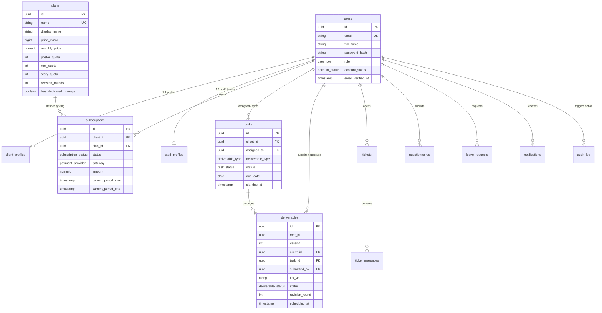

# 🗄️ Creo Platform — PostgreSQL Database Architecture & Operations

This directory contains the complete database definition, schema DDL, seed data, local Docker infrastructure, and CLI management utilities for the **Creo** platform.

The system is built exclusively on **PostgreSQL** (PostgreSQL 15+ / 16+ / 17+ on Supabase or local Docker) with `asyncpg` connection pooling.

---

## 📂 Directory Structure

```
database/
├── schema.sql              # Pure PostgreSQL DDL (Extensions, ENUMs, Tables, Triggers, Views)
├── seed_data.sql           # Idempotent seed data (Plans, Demo Staff, Clients, Deliverables)
├── docker-compose.db.yml   # Standalone Docker Compose for local PostgreSQL 16 & Redis 7
├── init.py                 # Python database CLI management utility
└── README.md               # This documentation
```

---

## 🏛️ Schema Architecture

### 1. Custom PostgreSQL ENUM Types
| Enum Type | Allowed Values |
| :--- | :--- |
| `user_role` | `super_admin`, `admin`, `sales`, `team_lead`, `editor`, `designer`, `client`, `investor_relations` |
| `account_status` | `pending_verification`, `active`, `lapsed`, `suspended`, `cancelled` |
| `subscription_status`| `trialing`, `active`, `past_due`, `canceled`, `incomplete` |
| `deliverable_type` | `reel`, `carousel`, `story`, `static_post`, `shoot_day` |
| `deliverable_status`| `draft`, `in_production`, `pending_qa`, `qa_rejected`, `pending_approval`, `revision_requested`, `approved`, `scheduled`, `publishing`, `published`, `publish_failed`, `archived` |
| `task_status` | `backlog`, `in_production`, `internal_qa`, `client_review`, `ready_to_publish`, `completed` |
| `ticket_status` | `open`, `in_progress`, `waiting_on_client`, `resolved`, `escalated` |
| `ticket_priority` | `low`, `medium`, `high`, `urgent` |
| `payment_provider` | `razorpay`, `stripe`, `manual` |

---

### 2. Core Tables & Relationships



---

## ⚡ Views & Materialized Views

1. **`v_client_onboarding` (View)**:
   - Derives client onboarding progress stage (`1` to `5`) in real-time based on database facts:
     - Stage 1: Email verified or active account.
     - Stage 2: Service terms accepted (`client_profiles.terms_accepted_at`).
     - Stage 3: Active production retainer subscription (`subscriptions.status IN ('trialing', 'active')`).
     - Stage 4: Brand DNA questionnaire submitted (`questionnaires`).
     - Stage 5: Full onboarding approved (`client_profiles.onboarding_completed_at`).

2. **`mv_exec_kpis` (Materialized View)**:
   - Computes aggregated MRR (`mrr_minor`), active subscription counts, 30-day churn, and average delivery turnaround time in hours.
   - Refreshed with `REFRESH MATERIALIZED VIEW CONCURRENTLY mv_exec_kpis;`.

---

## 🛠️ Operating the Database

### 1. CLI Management Utility (`init.py`)

The `database/init.py` script provides unified commands for inspecting and maintaining PostgreSQL:

```bash
# Test connectivity and print database engine info
python database/init.py --check

# Print table statistics and row counts
python database/init.py --stats

# Apply schema directly from schema.sql
python database/init.py --schema

# Seed initial plans, staff, clients, and deliverables
python database/init.py --seed

# Execute all in sequence (check, schema, seed, stats)
python database/init.py --all
```

---

### 2. Running Local PostgreSQL + Redis via Docker

If you prefer to run a completely local instance without connecting to the cloud Supabase instance:

```bash
# Start local PostgreSQL 16 on port 5432 and Redis 7 on port 6379
docker compose -f database/docker-compose.db.yml up -d

# Check container status
docker compose -f database/docker-compose.db.yml ps

# View database container logs
docker compose -f database/docker-compose.db.yml logs -f postgres

# Stop containers
docker compose -f database/docker-compose.db.yml down
```

The container automatically mounts:
- `schema.sql` into `/docker-entrypoint-initdb.d/01-schema.sql`
- `seed_data.sql` into `/docker-entrypoint-initdb.d/02-seed.sql`
- Data persists in the named volume `creo_pgdata`.

---

### 3. Alembic Migrations (Backend)

When evolving the schema through Python ORM models:

```bash
cd backend

# View migration history
alembic history

# Upgrade to latest schema
alembic upgrade head

# Create new auto-generated migration
alembic revision --autogenerate -m "describe_change"
```

---

## 🔒 Security & Credentials

- Passwords in `seed_data.sql` are hashed with **bcrypt (Cost 12)**.
- Sensitive credentials, direct connection strings, and JWT secrets are stored exclusively in `.env` (which is git-ignored).
- The direct connection string for PostgreSQL connects via `DIRECT_DATABASE_URL` with statement cache disabled (`statement_cache_size=0`) for optimal compatibility with Supabase connection poolers (PgBouncer).
